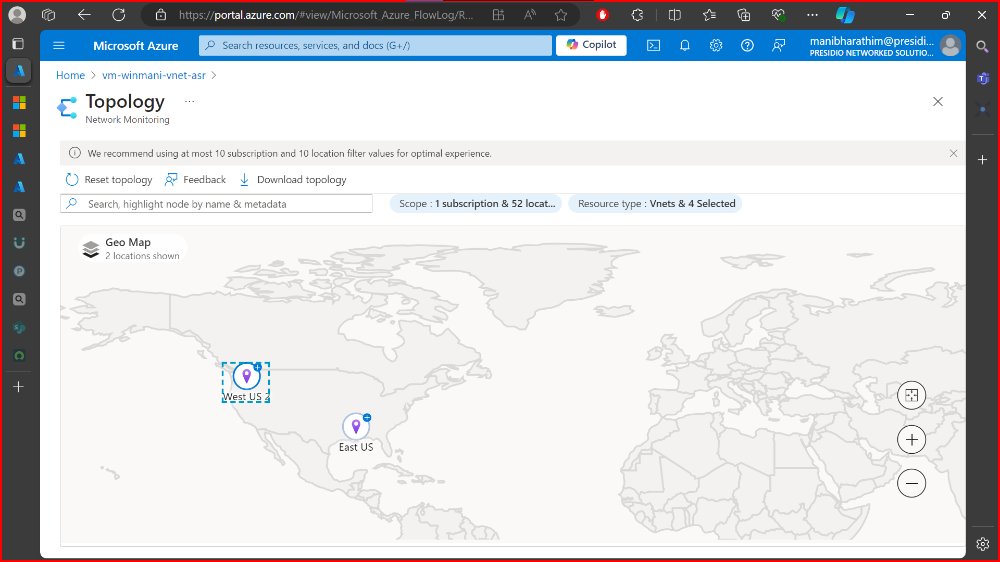
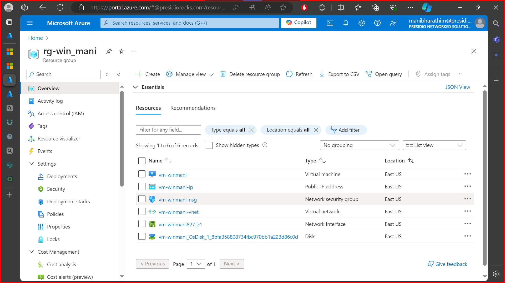
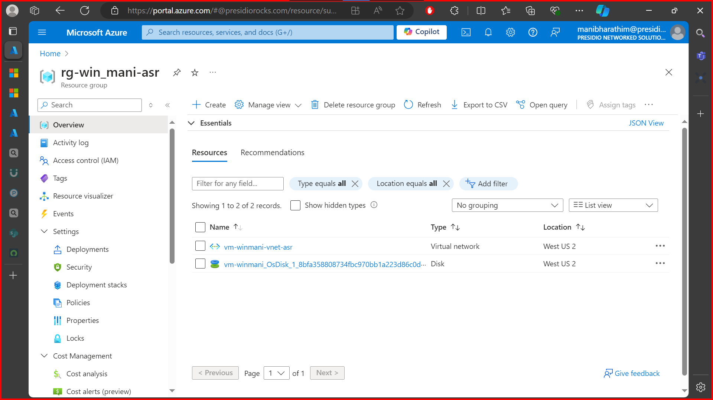
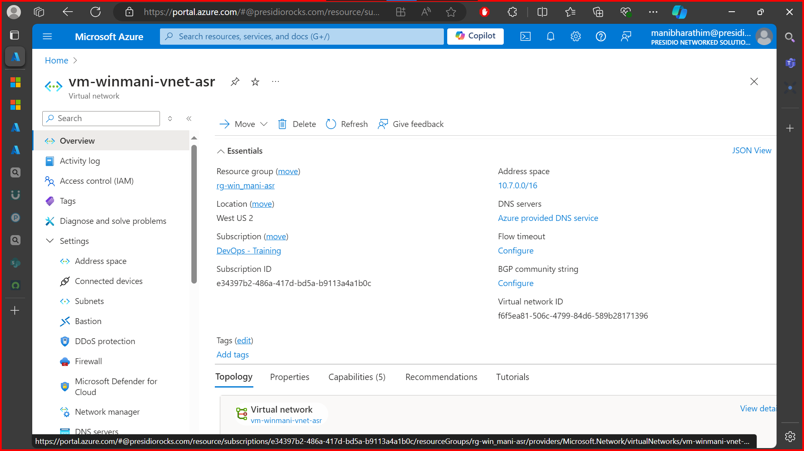
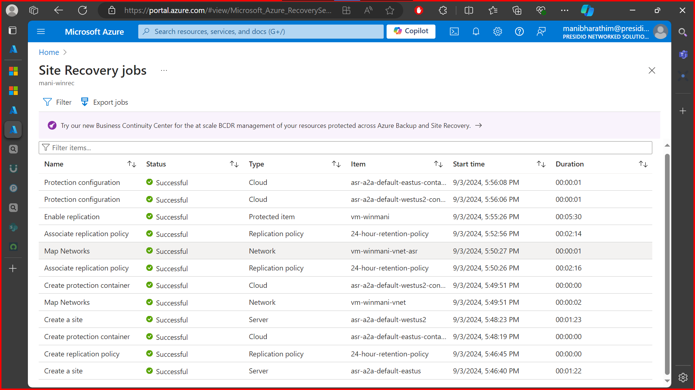

# Task 1
Perform migration of 3 tier application (assess to migration) with Azure Migrate:
Create 3 VMs in one region and deploy some sample application
Do Assessment of migration of all 3 tier application(3 VMs of Servers)
Migrate all the servers to another region
Verify application is accessible from migrated region

# Task 2

## Pipeline migration: Source: GitLab Destination: GitHub

## Reference:

[Github](https://github.com/RajKousik/Pipeline-Migration)
[Gitlab](https://gitlab.com/rajkousik20/pipeline-migration-test)

## Project Overview

1. **Create a Simple MERN Application**:

   - Set up a basic MERN stack application with separate `frontend` and `backend` directories.
   - The backend will be a Node.js/Express application.
   - The frontend will be a React application.

2. **Set Up CI/CD Pipeline in GitLab**:

   - Create a `.gitlab-ci.yml` file to automate the installation of dependencies, running tests, and deploying the application.
   - The pipeline should include three stages: `install`, `test`, and `deploy`.

3. **Migrate the Pipeline to GitHub Actions**:
   - Convert the GitLab CI/CD pipeline to a GitHub Actions workflow.
   - Ensure the same stages (`install`, `test`, `deploy`) are implemented in the GitHub Actions workflow.

# Task 3

## Disaster Recovery: Azure Site recovery and backup

Collaborated With [Manibharathi](https://github.com/itsmanibharathi) for the 3rd task

